# Concordia Big Data Course Project

This is a project for Concordia's Big Data class (SOEN691 UU) by Dr. Tristan Glatard in Winter 2020.
Team Members:

1. Le, Manh Quoc Dat (Student ID: 40153127)
2. Tran, Trong Tuan (Student ID: 40151694)
3. Phan, Vu Hong Hai (Student ID: 40154023)
4. Zhang, Yefei (Student ID: 40153319)
  
<!-- 
The team will work on both topics in this project: dataset analysis and algorithm implementation, for tackling an e-commerce recommendation system's problem. The dataset will be an open one from Kaggle or some other alternative open source.
  
There are some prominent candidate datasets: 
1. Elo Merchant Category Recommendation, Kaggle: https://www.kaggle.com/c/elo-merchant-category-recommendation 
2. Amazon Review Data 2018: https://nijianmo.github.io/amazon/index.html 
3. Goodreads Book Reviews: https://sites.google.com/eng.ucsd.edu/ucsdbookgraph/home 
  
Regarding the algorithms, there are a lot of them, and we need to choose based on the actual performance of experiments. We will try one method to be mentioned in the class like a collaborative filter, plus might be one that is not inside the class, and come up with a comparison in the evaluation of both methods, with a typical Root-Mean-Square Error (RMSE) as the indicator.
-->
  
## Abstract

The data from wearable gadgets (i.e. smartwatches or fitness tracking devices) is a reliable source that provides a lot of knowledge and potential to build a wide range of health-related applications such as health monitoring and physical training recommendation. Along with the increase in quantity and quality of data, the need to get the most out of data is more and more crucial. However, these data are heterogeneous, noisy, individual driven and sequential based, which are the key challenges to deal with. In this project, the main interests of our group are analyzing and building models that can predict people's heart rates based on sequential data from sensors. The dataset is collected from endomondo.com by the authors of [1], which contains about 200.000 records of over 1000 users with a couple hundred million of sensor measurements and metadata. In this project’s scope, we will develop machine learning (ML) models with the main concern about being able to process big time series data with 2 different approaches: one with the traditional methods learned in class and available in Spark, while another one to explore some methods a little bit more advanced, then compare them together.
  
## Introduction

The wearable gadgets such as smartwatches are becoming more and more popular nowadays. With many sensors, they can provide a lot of useful information about individual users as well as the environment. With appropriate data mining techniques, we can use these data for a larger potential application domain such as context-aware health supervisors. To achieve these such capabilities, there are several challenges that need to be overcome: (1) the collected data are sequential, type diversity and noisy, (2) the activity patterns and subjects' condition changes over time, and (3) the mining models need to be either small enough to be implemented on wearable gadgets or big enough to handle huge amounts of requests each time.
 Under the course's scope, we divide our work into 2 main folds following the typical framework:

1. Apply learned techniques to analyze and preprocess the dataset: the raw data contains lots of noisy metadata that need to rectify. We also need to calculate several derived features to improve the models' performance.
2. Implement ML models that can be scaled in Spark: We expect to implement at least two prediction models in Spark to predict the heart rate of individual users based on the context of the training such as historical workout, current heart rate, and user-dependent features. We are planning to implement non-deep learning models only for the sake of limited processing time.
  
Recently, there were several relevant works in mining sensor data for health area: [2] provided an overview of data mining research in healthcare and discussed the impact of these techniques on pervasive sensing market; Farseev et al. proposed a model that combined collected exercises and social network data to predict users’ wellness trend (Body Mass Index - BMI) using AdaBoost-based method [4]; [3, 24] built context-aware models that applied in many fields such as recommendation, social network and clinical predictions using individual information like BMI, age, gender, etc.
  
## Materials and Methods  
  
### Dataset

The dataset used in this project is collected by Ni et al. in [1] from [endomondo.com](https://sites.google.com/eng.ucsd.edu/fitrec-project/home). The data contains sensors data: heart rate, timestamps, distance, speed, ... and contextual data: GPS location (longitude and latitude), altitude, gender, sport (activity) and users' ID, ... The overview of this dataset is described in Table 1.
  
**Table 1**: Endomondo dataset overview
|Attribute|Quantity|
|---|---|
|Number of workouts|253,020|
|Total number of records|111,541,956|
|Number of users|1,104|
|Average length (hours)|5.998|
  
The data set of each workout consists of 500 data points recorded through flexible time intervals from seconds to several minutes. Therefore, we need to deal with this kind of interval variation. In this project, after analyzing the data, our main goal is to predict the heart rate of each user over the course of the workout based on the sensors and contextual data. The heart rate prediction model then can help to warn users about the abnormal health condition and give recommendations about increasing or decreasing workout's intensity.
  
### Techniques and Algorithms

We consider data analysis as a part of preprocessing data to train the models. We are expected to find some insights about data to selecting and deriving features, which can help improve the ML models' performance. The main pre-exploratory techniques will be used are: 

1. Plotting and normalizing based on some distribution for each data type 
2. Calculating data's common statistics: mean, standard deviation, ... 
3. Using unsupervised techniques such as clustering to gain insight 
4. Generating derived features, using interpolation and resampling technique to fill missing data points 
  
After analyzing and preprocessing data, we will feed the data to our implemented algorithms, and base on PySpark as the main framework. Since the goal of our predictor is to predict the heart rate (beats per minute - BPM), the result can be acquired by two methods: (a) directly via a regression model, or (b) via a classification model with each specific value of BPM is considered as a label (considering about human heartbeats, there will be only maximum 200 labels). After considering multiple approaches, we decided to implement Rolling window technique with Regression random forest. The idea is to predict the value at the time step *t*, the model just needs information from *k* previous time steps. 

The variable in the dataset described in Table 2. We also need to derive some other features for our model:
1. The distance between 2 consecutive timestamps
2. The vacant speed at the current timestamps (missing data or lack of sensor)
3. The time of day

Since we are applying the traditional machine learning technique, feature engineering affects heavily to the performance of the prediction model. In this work, at each window, the features are:
1. Categorical features: sport, gender
2. Sequence features: longitude, latitude, altitude, time (hour), speed, heart rate, time variation, heart rate variation, speed, distance. These features are taken from every timestamp of the rolling window (except the heart rate and heart rate variation of current timestamp, of course)
3. Aggregation features: min, max, mean, standard variation of features in 2

The prediction model is tree-based, therefore we don't need to do feature standardization.

One of the key hyper parameters is the width of the rolling window *k*. If *k* is too small, lots of information will be ignored and if *k* is too big, the number of features will be too big. In our implementation, we chose a reasonable size *k*=3. 

We using rando grid search and cross-validation for the model's hyper parameters selection. The number of folds for cross-validation is set to 5. The used metric is RMSE. The detail of the model can be found in the corresponding notebook.

**Table 2**: Contextual data and measurement description

|Variable|Type|Unit|
|---|---|---|
|Heart rate|Sequence|Beat per minute| 
|Timestamp|Sequence|Unix timestamp|
|Speed|Sequence|Mile per hour|
|Longitude|Sequence|Degree|
|Latitude|Sequence|Degree|
|Altitude|Sequence|Ft|
|User ID|String||
|Sport|String||
|Gender|String|Male, female|

## Results
 
### Exploratory Data Analysis
*Note: we performed quite a lot of exploratory analyses but just summarize a few main points here. For more details, please go to the [Exploratory Analysis Notebook](https://github.com/HongHaiPV/concordia-bigdata-project/blob/master/BigData_Project_Explore.ipynb)*.
#### Data Set Overview
We first worked with the raw data set from the original project. Original columns & data type:  
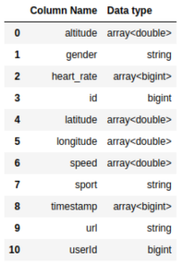
This is what the first 2 data rows look like:
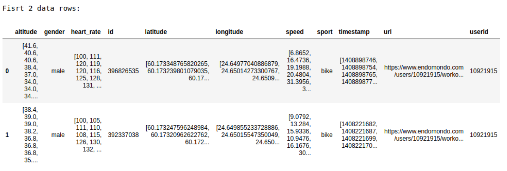
*Based on the column type, data frame description and the first 2 rows, we know that each data row is a record of a workout of a single user, with the associated activity type (sport) and other data like heart rates, locations and record times (timestamp).* 
 
High level summary of the data set:
 
|Users count|Activity types count|Workouts count|Total records count|
|---|---|---|---|
|1,104|49|253,020|111,541,956|
 
#### Filtering
During the exploration phase, we observed some abnormalities in some major columns.
- Missing / abnormal values across columns:
  - For string columns, we check for None and null
  - For numeric columns, we check for zeros and NaN
  - For array type columns, we check if the array contain zeroes or NaN

- The number of records in a per workout in a few workouts is abnormally low (`min` column):
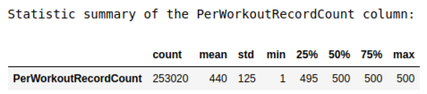
- There are some record intervals (differences in 2 consecutive timestamps of a workout) way to high compared to 95th percentile, example: 

- Statistical summary of heart rate by sport have some extreme outliers (mix/max) compared to normal range of 25-250 bpm:
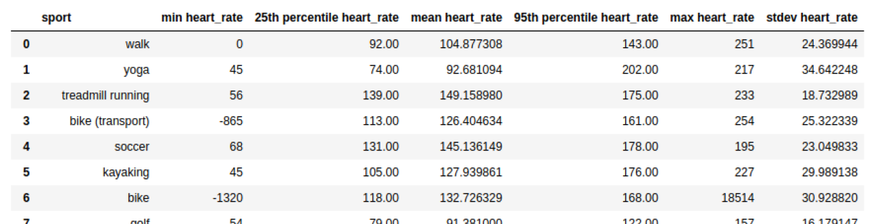  
 
Based on those abnormalities, we applied some filters for our data set to remove them:
1. Remove all rows containing heart rate below 25 and above 260 bpm
2. Remove rows that have less than 50 records
3. Remove rows having intervals larger than 278.35 (95th percentile of interval statistic)
Final result after filtering:   
|Users count|Activity types count|Workouts count|Total records count|
|---|---|---|---|
|1,092|46|201,710|89,201,998|

 
#### Class Imbalance
There are a lot of class imbalances in the data set. 
- Gender imbalance, where males’ users and activities are dominant vs. females’:

- Sport types imbalance, where a few sport took majority of the activities:
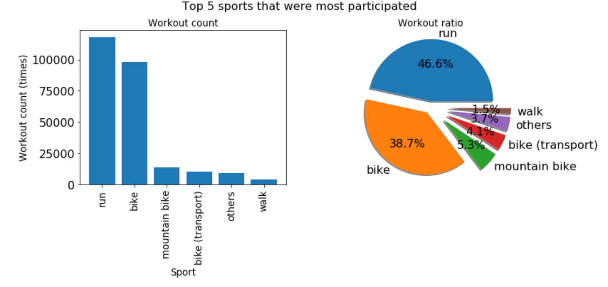
*Those class imbalances might heavily impact the prediction accuracy, especially when predicting users belong to minority classes. So during our sampling phase for model training, we will make sure to sample across all genders & sports.*
#### Some record level plots for visualization purpose
- Plot of heart rates on normalized time (duration from workout start), sampling from a few users
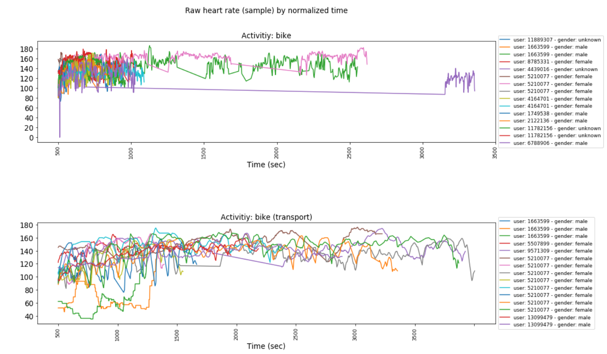
- Plot of some workouts ’ routes on 3D graphs based on longitude, latitude & altitude:
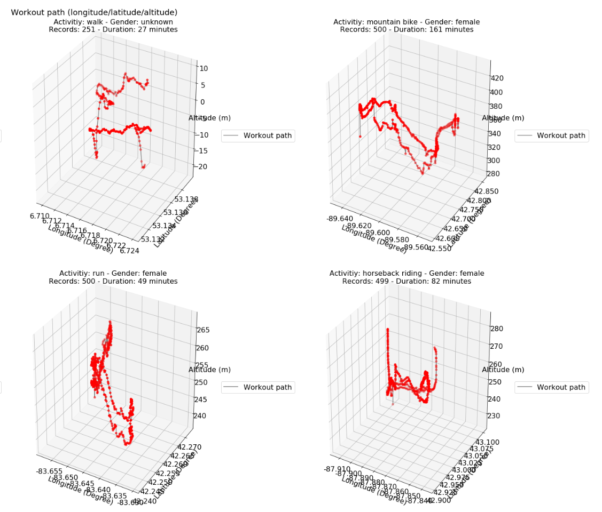
  
### Statistical Inferences
*Note: Details on statistical inferences section can be seen in the [Statistical Inferences Notebook](https://github.com/HongHaiPV/concordia-bigdata-project/blob/master/BigData_Project_Statistical_Inferences.ipynb) *
#### Some basic analyses
- Difference in average heart rate between male vs. female across sports:
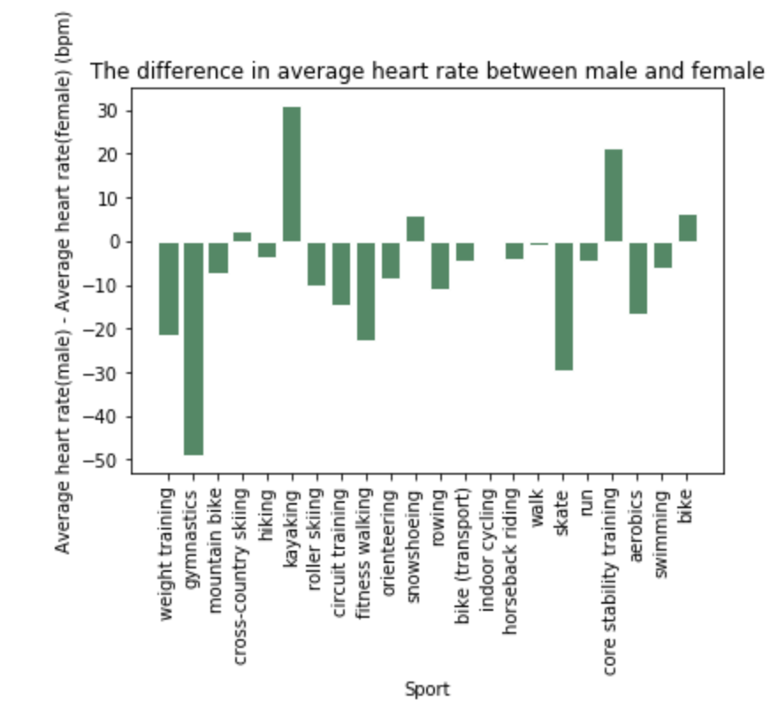 
This plot showed that in most of the sports having both genders participated, average heart rates of female are higher than male's.
 
- Difference in average Pearson coefficients of (heart rate, altitude) vs. average coefficients of (heart rate, speed):
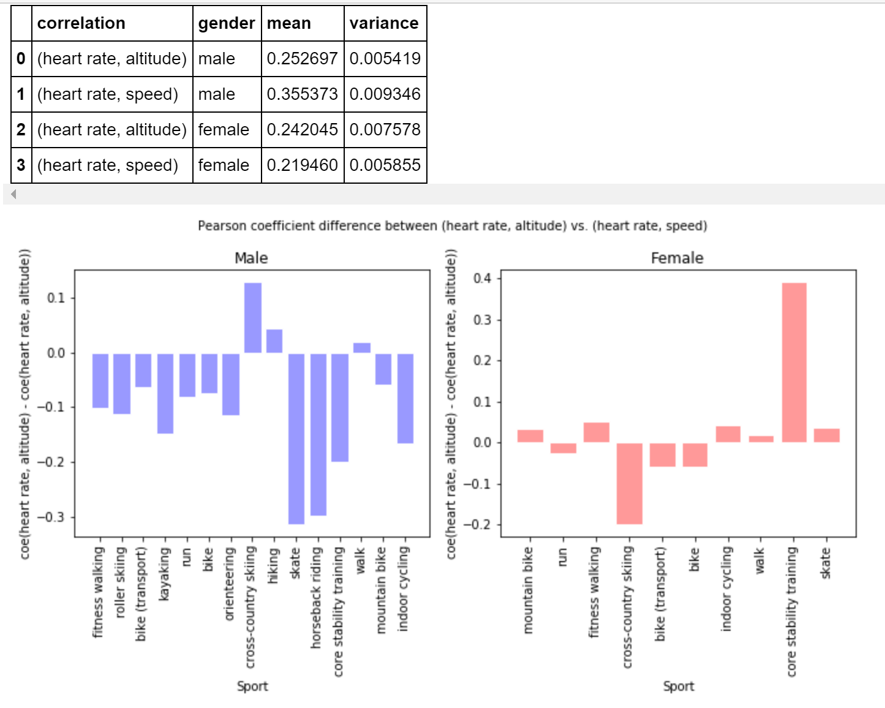
The 2 charts show that for both males and females, the average correlation between heart rate and altitude vs heart rate and speed are not too much different.
- Comparison between average of heart rate, speed and altitude across workouts started at different time periods of the day:
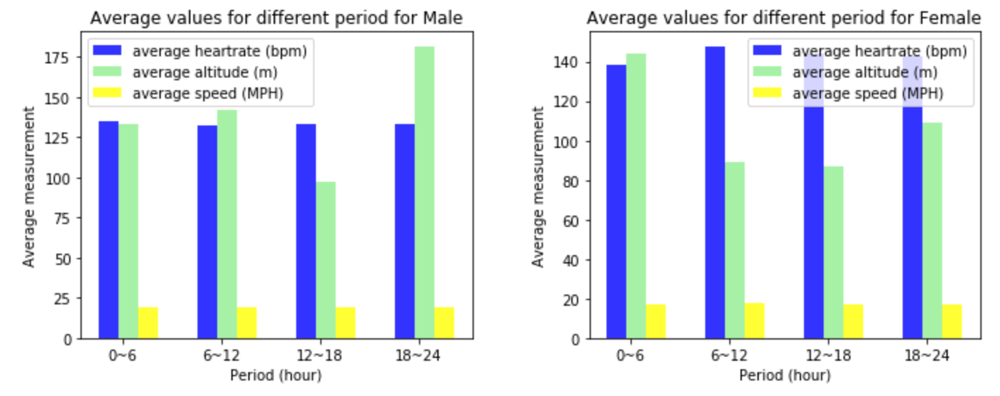
Again, for overall, average speed, altitude  and heart rate are not different among time periods.
#### K-means clustering to find similar users
We applied k-means clustering technique to group similar users, based on their gender, workout counts per period, workout count per sport, average heart rate, average speed and average altitude per workout (Since it’s just a preprocessing step, we did not put much resources to reach record level measurements, but just on average per workout level).   
- Example of users’ coordinate vectors: 
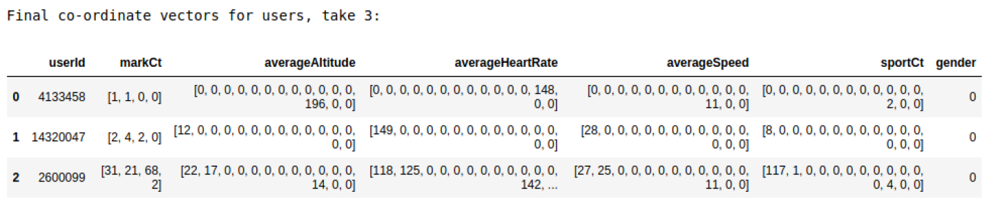
*Each feature above was **weighted by a predefined number** and also was **standardized by scaling factors** when calculating distances from users to centroids.*  
- K-means result:
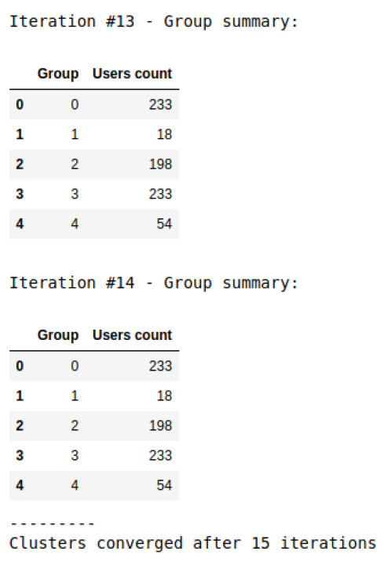
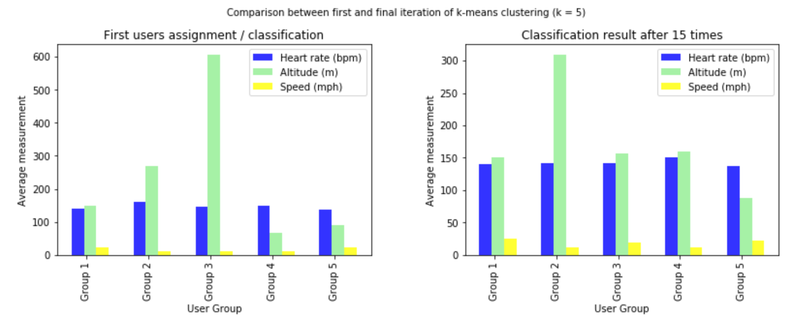
The summary plots on k-means results showed that average heart rate and speed do not differ much among groups, only the obvious difference is average altitude.
 
 
### Prediction Model

### Evaluation

We will use RMSE as the main metric to evaluate our efforts. The training and testing dataset will be divided by each user's workout.

## Discussion

### Limitations

- Random Forest algorithm’s disadvantages [6]:
  - It takes a huge amount of computational costs and memory to train a large number of deep trees.
  - Predictions are slower so that it could put challenges and pressure on applications.
  - The model created by the Random Forest algorithm is less explainable than an individual decision tree.

### Future Work

   Due to limited time offered, we could not have applied as many algorithms as we had planned. We decided to put them into our future work so that we could have much time to analyzing to get deeper insights of the dataset as well as implementing variety of models using different types of algorithms related to Time Series, for example, Conditional Random Field (CRF) and Recurrent Neural Network algorithms.

   There is an additional data file that we had not analyzed yet because we recognized that the data from it do not contribute a lot in our current model. However, there are some attributes from that dataset that could be helpful in other algorithms, such as weather, so we definitely need to work on this dataset to build models that have higher accuracy utilizing the two above-mentioned algorithms.

   Finally, we really want to embed each user’s historical workout measurements into our models. The reason behind that is that we want to develop a system that is user-centered. The system could personalize each user’s workout sequential modeling to predict how each user’s heart rates will fluctuate across each workout. In addition, the ability of the system could also be reached to identify clusters of users that share the common embedding structures and recommend alternative routes for users to achieve a heart rate profile [1].

## References

[1]. Jianmo Ni, Larry Muhlstein, Julian McAuley, "Modeling heart rate and activity data for personalized fitness recommendation", in Proc. of the 2019 World Wide Web Conference (WWW'19), San Francisco, US, May. 2019.

[2]. Hadi Banaee, Mobyen Uddin Ahmed, and Amy Loutfi. 2013. Data Mining for Wearable Sensors in Health Monitoring Systems: A Review of Recent Trends and Challenges. In Sensors

[3]. Miguel Ramos de Araujo, Pedro Manuel Pinto Ribeiro, and Christos Faloutsos. 2017. TensorCast: Forecasting with Context Using Coupled Tensors (Best Paper Award). In ICDM

[4].  Aleksandr Farseev and Tat-Seng Chua. 2017. TweetFit: Fusing Multiple Social Media and Sensor Data for Wellness Profile Learning. In AAAI

[5].  Soujanya Poria, Erik Cambria, Devamanyu Hazarika, Navonil Majumder, Amir Zadeh, and Louis-Philippe Morency. 2017. Multi-level Multiple Attentions for Contextual Multimodal Sentiment Analysis. In ICDM

[6]. S. Jansen, Hands-On Machine Learning for Algorithmic Trading [[Book]](https://www.oreilly.com/library/view/hands-on-machine-learning/9781789346411/). Packt Publishing, 2018.
